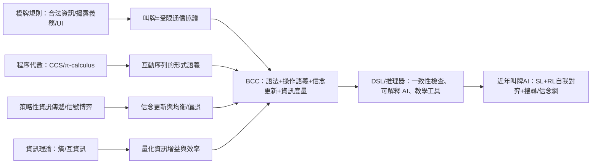

# 橋牌通信微積分：以 Bridge Communication Calculus 概念文為基礎的深度研究報告

## 執行摘要

使用者提供的「這篇」文章為一份未見公開發表（無 DOI、無可核驗公開連結）的概念性手稿，題名為「Bridge Communication Calculus（橋牌通信微積分／信號演算系統）」。其核心主張是：把橋牌叫牌視為**受規則約束的通信協議**，並嘗試融合三條理論主線——（一）以通信演算/程序代數刻畫多方互動序列（如 CCS、π-calculus 的思路），（二）以信號博弈與貝氏推論刻畫「叫牌≒訊息→更新對同伴/對手手牌的信念」，（三）用資訊理論（互資訊）量化每一步叫牌的「資訊增益」，並進一步構想一套可執行的 DSL（文中稱 BBDSL）與推理器/驗證器，讓叫牌系統可被形式化、檢查一致性、甚至用於可解釋 AI。fileciteturn0file0

從公開文獻回溯，這份手稿的方向並非憑空出現：早在 1993 年，entity["organization","University of Cambridge","cambridge, uk"]的技術報告就明確把「叫牌制度」視為一種人工語言的語義，並主張強橋牌 AI 的瓶頸在於**需要顯式推理知識、語用、機率與計畫**。citeturn11view0同時，橋牌運動本身的規則也把「搭檔溝通」嚴格限制在**叫品與出牌**，並把停頓、語氣、手勢等視為「未授權資訊（UI）」來源；任何形式化「通信」框架若不把這些規範內生化，很容易與實務/裁判體系脫節。citeturn4view0turn4view1turn5view0turn5view1

近五年（約 2021–2026）與該手稿最直接相連的前沿，其實集中在「叫牌 AI」：研究大量採用**監督式學習＋自我對弈強化學習＋（可選）測試時搜尋/信念網路**的混合架構，並以 entity["video_game","WBridge5","bridge software"] 與 OpenSpiel 資料集作為主要基準。代表性成果顯示：加入「信念建模＋測試時搜尋」可在對戰 WBridge5 的 IMP/牌局指標上取得顯著提升；同時也有工作證明「簡單訓練配方＋大量資料＋穩定自我對弈」即可達到或超越既有 SOTA，並開源以利可重現。citeturn7view1turn18view2turn18view3turn18view4另一些近作把叫牌序列轉為「約束」或「手牌機率分佈」後，用於抽樣與搜尋（例如首攻決策），強化了「把叫牌當成資訊通道」這一該手稿的直覺。citeturn27view2
* [Bridge Bidding via Deep Reinforcement Learning and Belief Monte Carlo Search](https://www.ieee-jas.net/article/doi/10.1109/JAS.2024.124488)

方法論上，這份概念文最大的優勢是「跨域整合的問題定義」：它把橋牌叫牌同時置於形式語義、博弈訊號、資訊量化三個座標系中，天然適合往**可驗證（verification）**與**可解釋（explainability）**方向延伸。fileciteturn0file0但其證據強度目前偏低：文本尚未給出可機器檢查的完整語法/操作語義、也未提出可重現的實驗設計（資料、評測、消融、與現代叫牌 AI 基準的對齊），因此現階段更接近「研究議程（research agenda）」而不是「已驗證的方法」。fileciteturn0file0

基於上述盤點，本報告提出 5 項可立即落地的後續研究/實務建議：建立「合法性/揭露義務」約束的形式化核心、把叫牌制度譯為可驗證 DSL、結合互資訊設計叫牌系統的資訊效率指標、建立跨制度資料與對手干擾下的評測協議、以及把形式推理與神經模型做「可解釋對齊」，用於教學與人機協作。每項建議均附帶預期成果、所需資源與風險控管，目標是把概念性的 BCC 轉化為可評測、可驗證、可用於訓練與比賽合規的工程與研究框架。citeturn4view0turn4view1turn21view0turn23search3turn3search16turn7view0

## 原文辨識與內容概述

本次研究以使用者上傳文件「BridgeCommunicationCalculus.md」作為「這篇」原文基礎；該文件本身未提供可公開檢索的正式出版資訊（如 DOI 或期刊/會議連結），因此「被引用情況」無法用 Google Scholar/引用索引直接追蹤，只能就公開網路以關鍵字做可重現的查找。fileciteturn0file0

就內容而言，該文把橋牌叫牌抽象為一個「通信演算系統」，包含：玩家代理（同伴/對手）、手牌類型（如牌型/點力）、叫品集合、叫牌歷史、信念狀態，以及呼叫貝氏更新來修正對同伴/對手手牌的後驗分布，同時以互資訊衡量每個叫品對降低不確定性的貢獻，並構想用 DSL 描述叫牌制度、用推理器檢查一致性與推導最佳行動。fileciteturn0file0其思想與「叫牌是受約定語義約束的訊息傳遞」相容，也與現代叫牌 AI 常見的「用叫牌序列推斷他家手牌分佈/約束」相呼應。citeturn27view2turn29view0

在「原文是否可於公開網路找到」方面，以完全一致字串 “Bridge Communication Calculus” 進行一般搜尋時，結果多落在與橋牌無關的「calculus」用法（如微積分教學或其他領域的 calculus），未出現可辨識為同一手稿的正式發表頁面，故目前合理判斷它屬於未公開發表或尚未被索引的概念文。citeturn0search8turn20search1

image_group{"layout":"carousel","aspect_ratio":"16:9","query":["contract bridge bidding box","duplicate bridge tournament bidding box","contract bridge auction bidding cards","bridge bidding at tournament table"],"num_per_query":1}

## 引用網絡與知識脈絡

原文在文末明示引用兩個來源：一是通信演算（CCS）的綜述性條目（以百科頁面指涉），二是把「最佳化後驗信念設計」視為演算法問題的 arXiv 論文（Mixture Selection）。fileciteturn0file0就嚴謹性而言，若以「原始/官方」優先，CCS 的基礎應回到 1986 年的技術報告《A Calculus of Communicating Systems》，它以同步通信、組合子與行為等價（如 bisimulation 的家族思想）奠定了後續程序代數的語彙。citeturn5view5turn4view3而 π-calculus 作為「可傳遞通訊連結/名字、描述網路拓樸可變」的程序代數，提供了「通信可改變連線結構」的形式化工具，對應到橋牌叫牌中「一個叫品改變未來可用叫品/推論路徑」的直覺。citeturn4view4turn5view3

在「信號/信念更新」主線上，原文把叫牌直觀地視為信號博弈：送訊者（某家）以叫品傳遞關於私有資訊（手牌）的訊息，接收者（同伴/對手）更新信念並回應。這一思想可對應到經典的策略性資訊傳遞模型（例如 1982 年的 Strategic Information Transmission），其分析重點是：當送受雙方目標不完全一致時，訊息可能出現「合併（pooling）」或「粗粒度揭露」，而非完全揭露。citeturn24search0原文另外提到用互資訊量化叫品資訊量，則可追溯到資訊理論對「訊息不確定性」與「資訊量」的定義框架。citeturn4view5turn5view4

更關鍵的是：橋牌不是任意通信系統，而是被規則強制塑形的通信。entity["organization","World Bridge Federation","governing body"]《複式橋牌規則》明確把搭檔間「可能暗示叫品或出牌」的額外訊息（言語、詢問、回答、未預期的 alert、停頓、語氣、手勢等）列為「未授權資訊」，並要求不得選擇「明顯受 UI 暗示」且存在邏輯替代行動的叫品/打法。citeturn4view0turn5view0其官方解說文件亦強調：alert 與回答問題是為了讓**對手**理解約定，不能作為與同伴合法溝通的途徑。citeturn4view1turn5view1在中文材料上，中華民國合約橋牌協會（文件提供者）對術語的雙語定義也強調「叫牌是由連續叫品決定合約的過程」，並定義「人為叫品」為傳遞之訊息偏離一般認知、不單純表示願意打該名目等。citeturn4view2這些規則約束意味著：若要把 BCC 做成「可用於比賽/教學的形式框架」，必須把「合法資訊來源/揭露義務/人為叫品與誤叫」納入模型，而不只是抽象地談訊息效用。citeturn5view0turn4view1turn4view2

值得注意的是，早期語用學/AI 社群已把橋牌叫牌當作「人工語言＋語用行為」的試驗場：entity["organization","University of Cambridge Computer Laboratory","cambridge, uk"]於 1993 年的報告（TR-299）指出叫牌制度可視為人工語言的語義，並用一個名為 Pragma 的系統嘗試結合規則推理、隨機模擬與神經網路學習。
* [A Simple, Solid, and Reproducible Baseline for Bridge Bidding AI](https://arxiv.org/html/2406.10306v1)
citeturn11view0turn9view0這條脈絡與本次概念文的「把叫牌做成可計算的語義/推理系統」高度一致，顯示 BCC 的定位可以被更精準地說成：站在「Pragmatics-in-bridge」傳統之上，吸收近年深度學習與形式驗證的工具，把叫牌語義由「口頭約定」推進到「可驗證之規格」。citeturn11view0turn3search5turn3search16

以下以流程圖整理「BCC 概念」所牽動的引用網絡（以知識主線呈現，而非僅列參考文獻）：

citeturn5view0turn5view1turn5view5turn4view4turn24search0turn4view5turn7view1turn18view3

## 近五年研究比較

近五年的主流叫牌 AI 研究，與 BCC 的關聯點主要在兩個層次：一是工程上已實作出「叫牌序列→推斷他家手牌分佈/約束→做決策」的管線；二是評測指標與資料來源逐漸標準化（OpenSpiel/ WBridge5 / DDS），使「形式化語義能否帶來更好的可解釋性與可驗證性」成為可檢驗問題。citeturn18view2turn7view1turn27view2turn23search1

下表彙整與 BCC 最相關的代表性工作（以 2021–2025 為主；另少量較早工作僅作背景）：

| 研究/系統（年份） | 方法特徵（與 BCC 對應） | 樣本/資料 | 主要發現（結果） | 主要限制（與 BCC 的缺口） |
|---|---|---|---|---|
| Qiu 等（2024，IEEE/CAA JAS） | 監督式學習初始化＋自我對弈強化學習；**測試時搜尋結合信念網路**（明確把「信念」作為決策組件） | 以 WBridge5 資料做 SL；以對戰 10,000 牌局評測 | 對戰 WBridge5 平均 +0.98 IMP/副牌，並宣稱高於既有 SOTA（+0.85 IMP/副牌）citeturn7view1 | 模型仍偏「黑盒」：信念網路的可驗證語義與合規揭露未明；指標集中在 IMP，較難直接解釋每一步叫品語義正確性citeturn7view1turn5view1 |
| Kita 等（2024，arXiv/IEEE 標頭） | **SL＋PPO＋Fictitious Self-Play** 的可重現配方；用 DDS 作報酬近似，並針對基準的評測效率提出批判與替代 | OpenSpiel 的 bridge 資料集（由 WBridge5 生成，採 SAYC 系統）＋12.5M DDS 預計算盤例citeturn18view2 | 以相對「簡單組合」達到/超越既有橋牌叫牌 SOTA，並開源程式碼與模型citeturn18view0turn18view4 | 以 DDS 近似真實打牌結果帶來「完美資訊」偏差；SL 資料之叫牌制度（SAYC）與 WBridge5 原生制度不同，語義對齊仍是難點citeturn18view2turn21view0 |
| Zhang 等（2025，LeadGenius） | 把叫牌序列轉為**手牌機率分佈＋約束擷取**，再用抽樣/搜尋（PIMC）做決策（雖針對首攻，但展示「叫牌作資訊抽取」的效果） | OpenSpiel 測試集抽樣 1,000 副牌；另描述硬體環境與雙執行緒設定citeturn27view2 | 宣稱首攻表現超越 WBridge5 並達到/超過比賽等級基準citeturn27view2 | 依賴特定叫牌制度規則來擷取約束；對「叫品語義」仍以工程規則為主，缺乏可證明的一致性規格citeturn27view2turn5view0 |
| Sztyber-Betleya 等（2023，BridgeHand2Vec） | 用神經網路學得「手牌向量表徵」，以 DDS 產生的墩數估計作學習目標；提出可用於「揭露約定/抽樣代表性牌例」等工具化想像 | 以 DDS 作監督訊號；聚焦表徵學習與應用示例citeturn29view0turn23search1 | 強調可解釋的手牌距離、樣本效率提升；並指出橋手有義務向對手揭露制度安排，純 RL 自創制度會帶來揭露困難citeturn29view0 | DDS 的完美資訊假設與真實對局有落差；「揭露」仍停留在想像層，未給出可機器檢查的語義框架citeturn29view0turn5view0 |
| Zhang 等（2022，Sensors） | 深度網路叫牌模型＋**互動式視覺化**，以「可解釋/可互動」作為系統目標之一 | 以人類叫牌系統為基礎預測/解釋；提供系統框架描述citeturn7view2 | 宣稱在多數比較中優於既有系統，並提出視覺化輔助理解citeturn7view2 | 「解釋」多偏展示層（visualization）；欠缺可驗證語義來保證解釋忠實度（faithfulness）citeturn7view2turn11view0 |
| Zhang 等（2022，Mathematics） | 以「雙網路：候選叫品產生＋局面評估」；並把叫牌序列轉成 30 個「跨制度一般特徵」，宣稱支持多制度對抗 | 描述以 2.5M 叫牌實例與專家輸入挑選特徵；並提到可在不同制度下解讀同一序列citeturn27view0 | 主張首次解決多制度對抗叫牌；把制度差異以特徵抽取邏輯吸收citeturn27view0 | 大量依賴專家規則/特徵工程；「一般特徵」是否完整保留語義、以及其一致性/衝突檢查仍缺乏形式保證citeturn27view0turn5view0 |
| Wang 等（2024，Neural Computing & Applications，收錄頁） | 以生成對抗推斷（GAI）提升同伴資訊推斷可靠性，並做交替推斷-決策 RL（AID-RL） | 以論文摘要/索引頁資訊可得；細節受限於平台存取citeturn2search14turn19search30 | 研究焦點落在「推斷品質＋決策聯訓」citeturn2search14 | 可重現細節不易取得；同樣面臨語義揭露與合規框架未形式化的共通問題citeturn2search14turn5view1 |

整體一致性與矛盾點可概括為三組張力：

第一，**顯式信念建模 vs. 端到端自我對弈**。一方面，將信念網路納入（如 2024 的 DRL＋belief search）可直接對應「叫牌→後驗」的理論描述；另一方面，基於自我對弈的端到端學習常主張不必顯式建模信念也能變強，導致「可解釋性/可揭露性」與「性能」之間的權衡成為核心議題。citeturn7view1turn18view3turn23search22

第二，**制度依存的語義 vs. 跨制度的一般化**。SAYC 等公開制度（由 ACBL 提供手冊）有清楚的語義文本，可作為 DSL 目標語義；但競賽/實務中存在多制度共存與對手干擾，迫使模型要嘛學「制度條件式語義」，要嘛用特徵工程把制度差異吸收。BCC 的潛在價值在於：提供一個把「制度＝語義規格」內生化的表示，使跨制度推論不再只靠黑盒擬合或人工特徵。citeturn21view0turn27view0turn11view0

第三，**用 DDS 近似報酬的效率 vs. 完美資訊偏誤**。大量工作用 DDS（雙明手求解器）把「叫牌好壞」轉成可計算的報酬，以提升訓練效率；但 DDS 本質上假設全牌可見且最佳打法，與真實不完全資訊打牌存在系統性落差。若 BCC 要成為長期基礎設施，需能明確區分「語義推論（叫牌階段）」與「打法近似（報酬生成器）」的偏誤來源。citeturn18view2turn23search1turn29view0

## 方法論與證據強度評估

以研究設計角度看，原文屬於「概念性框架＋研究議程」，其方法論強項是提出一個可把多個成熟理論模組化銜接的架構：用程序代數描述互動序列，用信念更新描述推論狀態轉移，用互資訊衡量訊息效率，並把 DSL/推理器作為落地路徑。fileciteturn0file0但就「證據強度」而言，目前缺乏三類關鍵構件，使其尚不足以被視為可檢驗的「方法」：

其一，缺少可機器檢查的**形式定義**。文本描述了想要的元件（手牌型別、叫品、信念狀態、更新規則），但未給出完整語法、型別系統、操作語義（例如以標號轉移系統 LTS 定義每一步 call 的效應）、以及等價/精化（refinement）關係，因此也無法談「驗證」或「模型檢查」的可操作範圍。相較之下，程序代數傳統的價值正是在於把系統行為落到 LTS 與行為等價上。citeturn4view4turn5view3turn5view5

其二，缺少面向橋牌實務的**合規約束內生化**。橋牌規則把 UI、alert、揭露義務、以及「叫品含義屬於搭檔約定」等規範寫得非常具體；若 BCC 想把叫牌當成「通信協議」，至少要能表達（a）合法資訊來源，（b）制度語義的公開文本，（c）人為叫品/誤叫與其裁判語義，（d）對手干擾下的語義分歧。citeturn5view0turn5view1turn4view2turn21view0原文目前只在概念層提到「信號」與「推論」，尚未把「法律語義」與「推論語義」對齊。fileciteturn0file0

其三，缺少可重現的**實證評估**。近年叫牌 AI 已形成可對話的共同語言（OpenSpiel 資料集、WBridge5、IMP/副牌等）並逐步走向開源可重現；若 BCC 要證明其價值，至少應提出：在何種任務上（例如制度一致性檢查、產生可揭露的語義摘要、偵測制度矛盾、或提升人機協作）相對於純神經模型能帶來可量化改善。citeturn18view4turn7view1turn29view0

在偏誤、假設與未檢驗變項方面，可點出幾個「一旦落地就會出現」的風險來源：

原文隱含假設「叫品能被建模為明確的信號」，但在競賽規則中，叫品的含義由搭檔約定決定且必須揭露給對手；同時，誤叫/忘記約定在實務上存在，且裁判語義區分「約定」與「實際手牌」並不一致。這使得「信號語義」至少要區分三層：制度語義（公開）、玩家意圖（可能偏離）、以及觀察者的推論（受 UI/tempo 等限制）。citeturn5view1turn25view0turn21view0

此外，若用互資訊評估「資訊效率」，也必須明確指定隨機變數與條件化歷史（history）的選擇，否則互資訊大小可能被「資料生成方式」（例如資料是由 SAYC 生成或由某一程式生成）主導，而非反映制度本身。近年研究已顯示：資料集的制度來源（SAYC vs WBridge5 原生）會直接影響訓練與評測的語義對齊。citeturn18view2turn21view0

最後，若要用「推理器」判定某一步叫牌是否最佳，必須先釐清效用函數：是以 DDS 近似的最終分數、以 IMP、還是以「到達可打合約」的機率？不同選擇會對應到不同的「制度設計目標」，也會影響是否鼓勵競叫干擾。這在叫牌 AI 文獻中通常透過評測協議解決，而 BCC 需要把它形式化。citeturn18view2turn7view1turn23search1

## 後續研究與實務應用建議

以下建議以「可執行」為標準：每項包含預期成果、所需資源與風險。其共同目標是把概念性的 BCC 推進成「可驗證、可評測、合規可用」的框架，並能與近年的叫牌 AI 基準對齊。citeturn11view0turn18view4turn5view0turn5view1

**建議一：先做「合規核心（Compliance Kernel）」——把 WBF 規則轉成 BCC 的型別系統/約束層**  
預期成果：定義一組最小但可運行的形式規格，至少能判斷：（a）某叫品在拍賣序列下是否「規則上合法」（例如不足叫、加倍/再加倍條件），（b）某資訊來源是否屬 UI，（c）在存在邏輯替代行動時，是否禁止採用 UI 暗示行動。這可成為 DSL 的 type checker/validator，並把「裁判語義」變成可計算的限制條件。citeturn5view0turn5view1turn31view1  
所需資源：1 位熟悉橋牌裁判規則的專家＋1–2 位形式方法/語言工具工程師；需要可引用的規則文本（WBF Laws、官方 commentary、各國聯盟補充規定）。citeturn4view0turn4view1turn25view0  
可能風險：規則條文存在解釋空間（裁判裁量、不同賽制細則），若過度硬編碼可能導致「形式規格」與「實務裁判」不一致；需設計可配置的規則層（profile）。citeturn25view0turn5view1

**建議二：把「叫牌制度＝語義規格」落到 DSL，並提供「可揭露摘要」自動產生器**  
預期成果：建立一個能描述制度、可產生「對手可理解之制度卡/摘要」的 DSL：一方面提供 AI/推理器可用的形式語義，另一方面自動生成符合揭露義務的文本/圖表，緩解純 RL 自創制度「難以揭露」的制度性障礙。這與近作指出的「自創制度會遇到揭露問題」直接對應。citeturn29view0turn5view0turn25view0  
所需資源：語言設計者（可以從既有制度文本如 SAYC 開始）、前端展示與可視化工程（可參考既有互動視覺化叫牌系統的做法）、以及一組制度測試集（涵蓋常見序列與干擾）。citeturn21view0turn7view2  
可能風險：制度語義常包含大量「例外/情境式」條款（尤其競叫），DSL 若過度追求完整可能變得難寫難用；建議從「可覆蓋 80% 常用序列」的核心子集起步，並提供逃生機制（unknown/unspecified）。citeturn21view0turn27view0

**建議三：建立「資訊效率儀表板」——用互資訊/不確定性下降衡量制度設計與叫牌步驟**  
預期成果：把原文提出的互資訊概念工程化：對每一步叫品，估計同伴手牌分佈的熵下降、或在特定制度下的資訊增益，形成「制度對不同牌型/情境的資訊路由圖」。這可用於（a）教練/學習者檢視制度是否在關鍵分歧點提供足夠資訊，（b）比較兩套制度在相同成本（叫品長度）下的資訊效率，（c）指導 AI 訓練時的 reward shaping。citeturn4view5turn18view2turn11view0  
所需資源：大量盤例資料＋可計算的信念更新器（可用現代叫牌 AI 的「手牌機率模型」作近似），以及對應制度的語義解析。citeturn27view2turn7view1turn18view2  
可能風險：互資訊估計高度依賴資料生成分布（例如資料是由某一制度生成）；若未控制分布偏誤，儀表板可能只是在量測「資料集偏好」不是制度本質。需設計跨分布的校準（例如多制度混合、或以合規規則生成合成資料）。citeturn18view2turn27view0

**建議四：把「叫牌序列→約束擷取」形式化，並與神經信念模型做可解釋對齊（explanation alignment）**  
預期成果：近作已展示：從叫牌前幾輪擷取對手/同伴手牌約束，再配合機率模型與抽樣/搜尋能提升決策品質。下一步是把這些約束擷取規則用 DSL/演算表示，並要求神經信念模型的輸出與「可證明的約束」一致（例如不產生違反已知約束的高機率樣本）。這可同時提升性能與可解釋性，並使模型更容易向人類說明「我為何推斷你有/沒有某花色」。citeturn27view2turn7view1turn11view0  
所需資源：需要一組可檢驗的約束語法（例如以一階邏輯或受限約束語言表達），以及把神經模型輸出做「約束投影/校正」的工程。citeturn3search16turn3search5  
可能風險：過強約束可能導致模型在制度誤差（誤叫、心理叫）下失去魯棒性；必須引入「軟約束/置信度」層，並遵守 UI 規則避免把不合法訊息納入推論。citeturn5view0turn5view1

**建議五：建立「制度一致性與衝突檢查」的標準任務與基準，補足現有 IMP 導向評測的盲點**  
預期成果：現行主流評測常以對戰 WBridge5 的 IMP/副牌作總分指標，但這很難告訴我們「制度是否自洽」、「某序列是否語義衝突」、「是否存在同一序列多解且未揭露」等語義問題。建議建立一組新任務：  
（a）制度規格靜態分析（找出不可達、矛盾、或未覆蓋分支）；（b）在對手干擾下的語義分歧測試；（c）人類可理解的制度卡/解釋正確性評測。這將直接把 BCC 的價值變成可量測指標。citeturn18view1turn11view0turn25view0  
所需資源：需要制度規格資料庫（可先收錄 SAYC 作為「公開、文本清楚」的起點）、以及一套測試盤例與標註（至少標註每一步叫品在制度下的語義）。citeturn21view0turn18view2  
可能風險：制度語義標註成本高、且不同教練/牌手對某些序列的「默契」不易一致；必須把「約定文本」與「實務慣例」分層記錄，避免把未揭露慣例誤當制度本身。citeturn25view0turn5view0

補充實務落地方向（與專利/產品證據呼應）：若把 BCC/DSL 用於比賽或教學系統，會自然連到「叫牌合法性檢查、避免不足叫/非法加倍、提示更正」等功能；近年的相關專利已顯示市場存在「自動檢查叫品合法性/叫牌資料庫化/叫牌裝置化」的需求。citeturn31view1turn31view0turn19search10