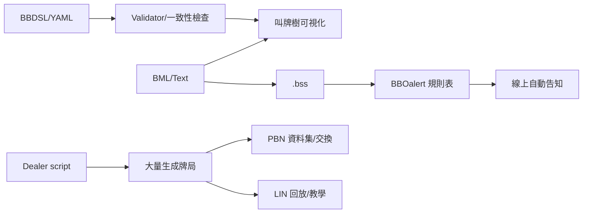

# 橋牌領域 DSL 現況盤點與比較

## Executive Summary
目前可辨識的橋牌 DSL 可分三群：**叫牌制度/告知自動化**（如 BML、BBOalert、以及你提供的 BBDSL 草案）、**牌局資料交換/呈現**（PBN 與 BBO 的 LIN 指令串），以及**大量發牌與模擬的限制式腳本**（Dealer）。citeturn6view0turn18view0turn2view4turn1search1turn4search1  
若目標是跨工具資料流與研究資料集，PBN 的「開放、可攜、涵蓋叫牌與打牌」特性最成熟。citeturn1search1turn1search5turn1search19  
若目標是線上實戰的自動告知與「減少打字摩擦」，BBOalert 的功能與近年版本更新顯示其社群使用仍活躍，但高度綁定 BBO 工作流。citeturn18view0turn22view0  
BML/BBDSL 更接近「可讀、可轉換、可驗證、可視覺化」的制度知識庫方向，但成熟度與採用度仍明顯小於 PBN/LIN/Dealer。citeturn9view0turn20view0 fileciteturn0file0  

## 範疇與判準
本報告將「DSL」定義為：在橋牌領域用來**形式化描述**（1）叫牌制度/約定、（2）牌譜（發牌、叫牌、打牌、結果/分析）、或（3）大量發牌/模擬條件的語言或結構化規格（不一定是可執行語言）。citeturn1search1turn4search1turn2view4turn18view0  

## DSL 一覽
| DSL（焦點） | 主要維護者/組織 | 官方文件/原始碼 | 首次發布年（可得） |
|---|---|---|---|
| BBDSL（叫牌制度可驗證 schema） | 未明（草案示例作者 C.C. Wei） | 上傳檔案：BBDSL-SCHEMA.md fileciteturn0file0 | 未明 |
| BML（叫牌制度筆記→HTML/LaTeX/BSS） | entity["people","Erik Sjöstrand","bml creator"]（原始）、entity["people","Gert-Jan Paulissen","bml maintainer"]（fork/工具） | entity["company","GitHub","code hosting platform"] repo 與 README citeturn6view0turn9view1turn20view0 | 2021（BML2 2.0.0 起，依 changelog）citeturn9view0 |
| BBOalert（BBO 自動告知規則表 DSL） | entity["people","stanmaz","bboalert maintainer"] | README/原始碼 citeturn23view0turn18view0；Firefox 版本史/授權 citeturn22view0 | 未明（至少 2020 已有公開討論）citeturn21search12 |
| Dealer script（限制式發牌/統計） | entity["people","Hans van Staveren","bridge software author"]；維護者：entity["people","Henk Uijterwaal","dealer maintainer"] | BBO Dealer Manual（含語法與作者）citeturn2view4turn12view1turn0search19 | 推估 1990（「first written in 1990 timeframe」之二手記載）citeturn15search2 |
| PBN（Portable Bridge Notation；牌譜交換/存檔） | entity["people","Tis Veugen","pbn coauthor"]、entity["people","Kaj G. Backas","pbn editor"]相關站點 | PBN 官網/標準 citeturn1search1turn1search5 | 1990（形成於 1990 的描述）citeturn1search6 |
| LIN（.lin；BBO 指令串牌譜/播放） | entity["company","Bridge Base Online","online bridge platform"]（格式隨其生態系演進） | HandViewer 文件（支援 lin 子集合與範例）citeturn4search1 | 未明（至少 2003 前已被討論）citeturn4search6 |

## 語法範例與核心功能
```text
# BBDSL（YAML schema；制度/特約/驗證）
bbdsl: "0.1"
openings: [{ bid: "1NT", meaning: { hcp: { min: 13, max: 15 } } }]

# BML（表格化叫牌樹；可含序列錨點 1N-2C;）
1N-2C;
 2D No 4 card major
 2H 5+♥, invitational

# BBOalert（context,call,explanation；支援 wildcard/regex/腳本）
1N__,2H,Transfer->!S

# Dealer（condition/action；大量產生符合條件的牌局）
condition shape(north, any 4333 + any 4423) and hcp(north)>=19
action printall

# PBN（tag-based；可含 Deal/Auction/Play/分析表）
[Deal "N:AKQJ.T9.. ..."]
[Auction "N"] 1NT Pass 3NT Pass Pass Pass

# LIN（雙字母命令串；常見 md/ah/sv/mb/pc/pg）
md|...|ah|Board 7|sv|b|mb|1S|mb|p|pg||pc|SQ|pc|S2|...
```

BBDSL 的核心設計是以可擴充 schema 描述**制度、特約模組、叫牌後續與驗證規則**，並明確把「可視覺化呈現叫牌邏輯樹、衝突/遺漏檢測、AI 可讀」列為目標。fileciteturn0file0  
BML 以「可讀的 bidding table + 轉換工具」為核心：可輸出 HTML/LaTeX，並能轉出（已過時的）BBO Full Disclosure .bss；同時支援競叫語法、座位/有無局等條件化描述與（部分格式）牌圖。citeturn9view1turn17view0turn20view0  
BBOalert 的 DSL 直接服務「在 BBO 上自動告知/自動填入說明」：提供 wildcard、regex、JavaScript 擴充腳本與 BSS 匯入等能力。citeturn18view0turn18view1turn18view2  
Dealer script 用於**發牌生成與統計**：以條件（牌型/HCP/各種函數）+ 行為（列印、統計等）構成，明確被定位為訓練與研究/設計約定的工具鏈之一。citeturn2view4turn0search19turn12view0  
PBN 是**跨平台牌譜通用表示**：官網描述其可用於 dealing/bidding/playing/teaching，且標準文件提供版本（1.0/2.0/2.1）與範例/表格擴充（例如 double-dummy 類表格）。citeturn1search1turn1search5（研究界也常將資料以 PBN 作為輸入/呈現介面）citeturn1search19  
LIN 以「雙字母指令 + |…|」串流形式封裝牌局（含叫牌/出牌），BBO HandViewer 文件明示其僅支援 lin 語言子集合並提供參數與範例。citeturn4search1  

## 技術棧、相容性與授權
| DSL | 技術棧/執行環境 | 授權/開放性 | 典型使用者/場景 |
|---|---|---|---|
| BBDSL | YAML/JSON 型 schema（工具鏈未明） | 未明 | 教練/研究者：制度知識庫、驗證、可視化、AI 讀取 fileciteturn0file0 |
| BML | 純文字標記；轉換器以 Python 工具鏈運作；MIT | MIT（repo 顯示）citeturn6view0turn7view1 | 教學/筆記發布（HTML/PDF）；舊 BBO FD 轉檔 citeturn20view0 |
| BBOalert | 瀏覽器擴充（含 scripting/regex）；Firefox/Chrome 工作流 | Mozilla Public Licence 2.0（在 Firefox 發佈頁標示）citeturn22view0 | 線上對戰/教學桌：自動告知、減少人工輸入 citeturn18view0 |
| Dealer | C/可攜可編譯程式；Unix/Cygwin/Windows 等 | 原始 README 宣稱 public domain citeturn12view0 | 模擬/研究：條件式發牌、統計；亦用於練習牌局生成 citeturn2view4 |
| PBN | 純文字檔案格式/開放標準 | 開放標準（標準文件可下載）citeturn1search5 | 比賽資料交換、教材、AI 資料集/分析 citeturn1search19 |
| LIN | 純文字指令串（BBO 生態系格式） | 專有/規格不完全公開（多為實作與逆向）citeturn3search6turn4search1 | 教學展示（HandViewer）、BBO 牌局回放/分享 |



## 優缺點比較與成熟度
| DSL | 優點（重點） | 缺點（風險） | 成熟度 | 社群活躍度（以公開更新/討論粗估） |
|---|---|---|---|---|
| BBDSL | 以「可驗證/可視化/AI」為設計中心 | 尚屬草案；落地工具鏈未明 | 低 | 未明 |
| BML | 人可讀、可轉 HTML/LaTeX；可映射舊 BSS | 近年更新較少（changelog 停在 2021 週期）citeturn9view0 | 中 | 低 |
| BBOalert | 直接解決實務告知；支援 regex/腳本；近期仍有版本釋出 citeturn22view0 | 綁定 BBO；規則表品質易隨人維護而漂移 | 中-高 | 高 |
| Dealer | 條件式生成與統計強；長期被引用為「發牌腳本語法」citeturn2view4 | 學習曲線偏技術；較難直接表達完整叫牌制度語意 | 高 | 中-低 |
| PBN | 開放且通用；涵蓋叫牌/打牌/事件資訊；研究與工具支援面廣 citeturn1search1turn1search5 | 官標擴充多，實作差異/相容性需測 | 高 | 中 |
| LIN | BBO 展示/回放便利；HandViewer 直接支援 citeturn4search1 | 規格不完全公開、長期相容性受 BBO 影響 citeturn3search6 | 高（在 BBO 內） | 中 |

## 下一步研究與實作建議
若你要做「制度 DSL → 教學/AI/實戰」一條龍，較務實的路徑是：**以 BBDSL 做語意最完整的制度知識庫**（驗證/衝突檢查先做起來），再選一個「輸出目標」：教學出版用 BML/HTML；線上實戰告知則生成 BBOalert 規則表（必要時再兼容舊 BSS）。citeturn17view0turn18view0 fileciteturn0file0  
若你要做 AI/模擬，建議把資料交換層固定在 PBN（訓練與回放都可用），並用 Dealer 生成「可控分佈」的合成資料（例如特定牌型/點力/競叫情境），再轉成 PBN/LIN 供人檢視與對練。citeturn2view4turn1search5turn4search1turn1search19  
需補查但目前資訊不足者：LIN 的完整語法/版本演進、BBO Full Disclosure（.bss）官方規格原文與授權邊界；本報告中此類項目已以「未明」或「推估」標註。citeturn3search6turn20view0